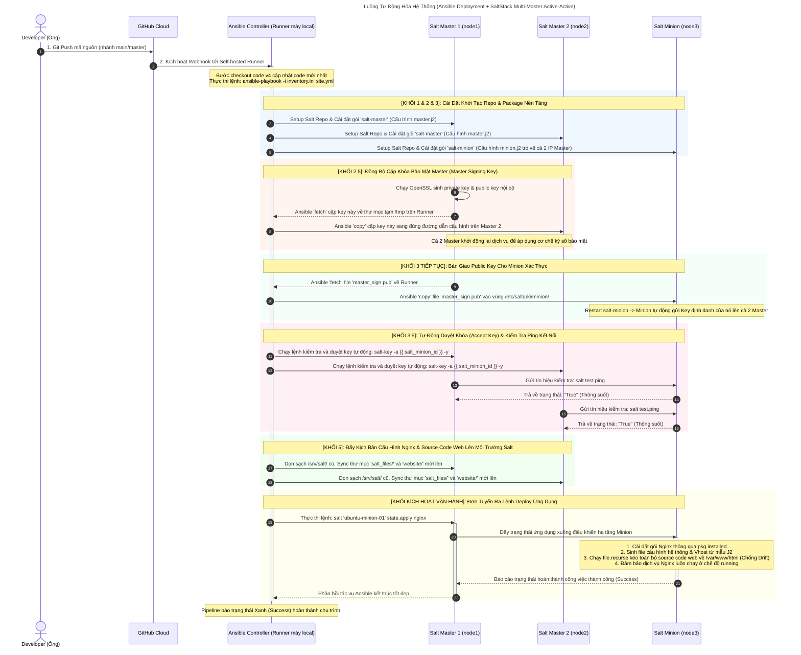

Sơ đồ tuần tự

```mermaid
sequenceDiagram
    autonumber
    actor Dev as Developer (Ông)
    participant GH as GitHub Cloud
    participant Runner as Ansible Controller (Runner máy local)
    participant M1 as Salt Master 1 (node1)
    participant M2 as Salt Master 2 (node2)
    participant Minion as Salt Minion (node3)

    title Luồng Tự Động Hóa Hệ Thống (Ansible Deployment + SaltStack Multi-Master Active-Active)

    Dev->>GH: 1. Git Push mã nguồn (nhánh main/master)
    GH->>Runner: 2. Kích hoạt Webhook tới Self-hosted Runner
    activate Runner
    Note over Runner: Bước checkout code v4 cập nhật code mới nhất<br/>Thực thi lệnh: ansible-playbook -i inventory.ini site.yml

    rect rgb(240, 248, 255)
        note over Runner, Minion: [KHỐI 1 & 2 & 3]: Cài Đặt Khởi Tạo Repo & Package Nền Tảng
        Runner->>M1: Setup Salt Repo & Cài đặt gói 'salt-master' (Cấu hình master.j2)
        Runner->>M2: Setup Salt Repo & Cài đặt gói 'salt-master' (Cấu hình master.j2)
        Runner->>Minion: Setup Salt Repo & Cài đặt gói 'salt-minion' (Cấu hình minion.j2 trỏ về cả 2 IP Master)
    end

    rect rgb(255, 245, 238)
        note over Runner, M2: [KHỐI 2.5]: Đồng Bộ Cặp Khóa Bảo Mật Master (Master Signing Key)
        M1->>M1: Chạy OpenSSL sinh private key & public key nội bộ
        M1-->>Runner: Ansible 'fetch' cặp key này về thư mục tạm /tmp trên Runner
        Runner->>M2: Ansible 'copy' cặp key này sang đúng đường dẫn cấu hình trên Master 2
        Note over M1, M2: Cả 2 Master khởi động lại dịch vụ để áp dụng cơ chế ký số bảo mật
    end

    rect rgb(245, 255, 250)
        note over Runner, Minion: [KHỐI 3 TIẾP TỤC]: Bàn Giao Public Key Cho Minion Xác Thực
        M1-->>Runner: Ansible 'fetch' file 'master_sign.pub' về Runner
        Runner->>Minion: Ansible 'copy' file 'master_sign.pub' vào vùng /etc/salt/pki/minion/
        Note over Minion: Restart salt-minion -> Minion tự động gửi Key định danh của nó lên cả 2 Master
    end

    rect rgb(255, 240, 245)
        note over Runner, Minion: [KHỐI 3.5]: Tự Động Duyệt Khóa (Accept Key) & Kiểm Tra Ping Kết Nối
        Runner->>M1: Chạy lệnh kiểm tra và duyệt key tự động: salt-key -a {{ salt_minion_id }} -y
        Runner->>M2: Chạy lệnh kiểm tra và duyệt key tự động: salt-key -a {{ salt_minion_id }} -y
        
        M1->>Minion: Gửi tín hiệu kiểm tra: salt test.ping
        Minion-->>M1: Trả về trạng thái: "True" (Thông suốt)
        M2->>Minion: Gửi tín hiệu kiểm tra: salt test.ping
        Minion-->>M2: Trả về trạng thái: "True" (Thông suốt)
    end

    rect rgb(240, 255, 240)
        note over Runner, M2: [KHỐI 5]: Đẩy Kịch Bản Cấu Hình Nginx & Source Code Web Lên Môi Trường Salt
        Runner->>M1: Dọn sạch /srv/salt/ cũ, Sync thư mục 'salt_files/' và 'website/' mới lên
        Runner->>M2: Dọn sạch /srv/salt/ cũ, Sync thư mục 'salt_files/' và 'website/' mới lên
    end

    rect rgb(255, 255, 240)
        note over Runner, Minion: [KHỐI KÍCH HOẠT VẬN HÀNH]: Đơn Tuyến Ra Lệnh Deploy Ứng Dụng
        Runner->>M1: Thực thi lệnh: salt 'ubuntu-minion-01' state.apply nginx
        activate M1
        M1->>Minion: Đẩy trạng thái ứng dụng xuống điều khiển hạ tầng Minion
        activate Minion
        Note over Minion: 1. Cài đặt gói Nginx thông qua pkg.installed<br/>2. Sinh file cấu hình hệ thống & Vhost từ mẫu J2<br/>3. Chạy file.recurse kéo toàn bộ source code web về /var/www/html (Chống Drift)<br/>4. Đảm bảo dịch vụ Nginx luôn chạy ở chế độ running
        Minion-->>M1: Báo cáo trạng thái hoàn thành công việc thành công (Success)
        deactivate Minion
        M1-->>Runner: Phản hồi tác vụ Ansible kết thúc tốt đẹp
        deactivate M1
    end
    
    deactivate Runner
    Note over Runner: Pipeline báo trạng thái Xanh (Success) hoàn thành chu trình.
```
