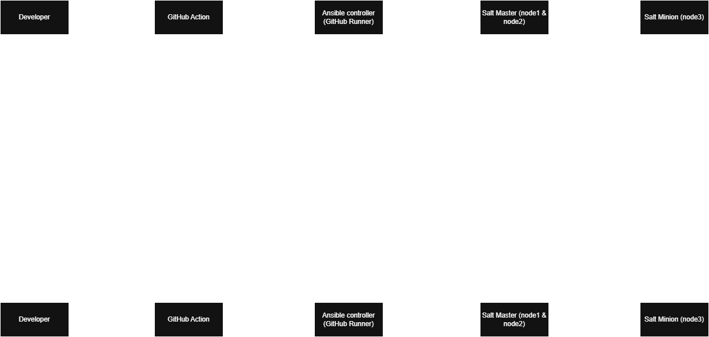

```text
ansible/                      # Thư mục gốc quản lý toàn bộ dự án (CI/CD + Automation)
├── .github/workflows/
│   └── deploy.yml                 # Pipeline GitHub Actions (bao gồm lệnh giải mã bí mật bằng Vault)
├── scripts/                       # Chứa các kịch bản lệnh bash bổ trợ vận hành hệ thống
├── website/                       # Chứa mã nguồn trang web cần deploy xuống Minion
│   └── index.html                 # Trang giao diện chính của website (sẽ sync qua Salt)
│
└── ansible/                       # Chứa toàn bộ kịch bản và cấu hình của Ansible
    ├── inventory.ini              # Định nghĩa IP/Role Master-Minion (Đã làm sạch, không chứa mật khẩu bí mật)
    ├── site.yml                   # Tệp thực thi chính (Entrypoint) để chạy toàn bộ Ansible Playbook
    │
    ├── group_vars/                #Thư mục quản lý biến tập trung theo nhóm host
    │   └── all/                   # Áp dụng cho tất cả các máy chủ định nghĩa trong inventory
    │       ├── vars.yml           # Định nghĩa biến cấu hình kết nối SSH chung của hệ thống
    │       └── vault.yml          # Lưu mật khẩu SSH/Sudo thực tế (Đã mã hóa an toàn bằng AES256 mã Vault)
    │
    ├── roles/                     # Thư mục quản lý các cụm tính năng (Roles) độc lập
    │   └── saltstack/             # Role xử lý toàn bộ vòng đời cài đặt, cấu hình SaltStack cho cụm HA
    │       ├── defaults/main.yml  # Định nghĩa các biến ứng dụng mặc định (IP Master, tên key, cấu hình sign...)
    │       ├── handlers/main.yml  # Chứa các bộ kích hoạt tự động restart dịch vụ Salt khi có thay đổi cấu hình
    │       ├── tasks/main.yml     # Logic cốt lõi: Cài đặt Salt, dọn ổ, đồng bộ key, xử lý failover cụm Master
    │       └── templates/         # Chứa cấu hình động dạng Jinja2 để sinh file config cho Salt
    │           ├── master.j2      # Mẫu cấu hình hệ thống cho 2 nút Salt Master (Active-Active)
    │           └── minion.j2      # Mẫu cấu hình định danh và trỏ cụm Multi-Master cho Salt Minion
    │
    └── salt_files/                # Nơi lưu trữ các kịch bản State (SLS) cục bộ của riêng SaltStack
        └── nginx/                 # Khối quản lý cấu hình trạng thái cho dịch vụ web Nginx
            ├── init.sls           # Kịch bản Salt định nghĩa cài gói Nginx, chống drift mã nguồn và watch dịch vụ
            └── templates/         # Chứa file cấu hình mẫu Nginx bàn giao cho Salt quản lý
                ├── nginx.conf.j2  # Bản mẫu cấu hình lõi hệ thống toàn cục cho dịch vụ Nginx
                └── site.conf.j2   # Bản mẫu cấu hình Virtual Host chạy website (Xử lý Port 80, Root dir)
```

Flow chạy

